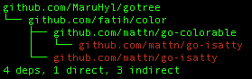

# gopkg
Print go dependency tree



## Installation

```sh
go get github.com/MaruHyl/gotree/gotree
```

## Command Help
```text
Show deps like tree.

Usage:
  gotree [flags]

Flags:
  -h, --help             help for gotree
  -j, --json             Prints out an JSON representation of the tree
  -l, --max_level int    Set max level of tree
      --nointernal       Filter out internal packages
      --noreport         Turn off dep/direct/indirect count at end of tree listing
      --nostd            Filter out std packages
  -p, --pattern string   List only those deps that match the pattern given
```

## Usage example

### --max_level
Limit the depth of the tree, and can reduce the execution time of `gotree`

`gotree -l 1`

output
```
github.com/MaruHyl/gotree
├── encoding/json
├── errors
├── fmt
├── github.com/MaruHyl/gotree/internal/std
├── github.com/fatih/color
├── golang.org/x/tools/go/packages
├── regexp
├── sort
└── strings
9 deps, 9 direct, 0 indirect
```

### --nostd
Ignore std packages, and can reduce the execution time of `gotree`

`gotree -l 1 --nostd`

output
```text
github.com/MaruHyl/gotree
├── github.com/MaruHyl/gotree/internal/std
├── github.com/fatih/color
└── golang.org/x/tools/go/packages
3 deps, 3 direct, 0 indirect
```

### --nointernal
Ignore internal packages

`gotree -l 1 --nostd --nointernal`

output

```text
github.com/MaruHyl/gotree
├── github.com/fatih/color
└── golang.org/x/tools/go/packages
2 deps, 2 direct, 0 indirect
```

### --pattern

List only those deps that match the pattern given.

`gotree -p mattn/go-isatty`

output

```text
github.com/MaruHyl/gotree
└── github.com/fatih/color
    ├── github.com/mattn/go-colorable
    │   └── github.com/mattn/go-isatty
    └── github.com/mattn/go-isatty
4 deps, 1 direct, 3 indirect
```