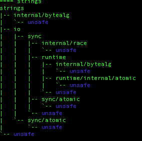
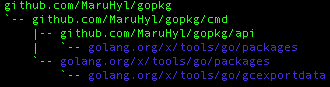

# gopkg
> Tools for go pkgs's inspection and analysis.
> Base on golang.org/x/tools/go/packages



## Installation

```sh
go get github.com/MaruHyl/gopkg
```

## Usage example

### Deps

#### Help

```text
Show dep list.

Usage:
  gopkg deps [flags]
  gopkg deps [command]

Available Commands:
  tree        Show deps like tree

Flags:
  -c, --case-insensitive   default(false): case insensitive
  -i, --exclude string     Only list packages that not match the pattern
  -h, --help               help for deps
  -p, --include string     Only list packages that match the pattern
  -l, --level int          Max deep level
  -s, --skip-std           Skip std library

Global Flags:
  -a, --args strings         Args are passed to go/packages directly (may be repeated)
  -b, --buildflags strings   pass argument to underlying build system (may be repeated)
  -m, --mode string          mode (one of files, imports, types, syntax, allsyntax) (default "imports")
  -t, --test                 include any tests implied by the patterns

Use "gopkg deps [command] --help" for more information about a command.

```

#### Example

```bash
gopkg deps -sc -l 1 -p gopkg -i "api|cmd"
```

### Tree

#### Help

```text
Show deps like tree. 
Support regexp(include and exclude), max deep level, json(todo), svg(todo).

Usage:
  gopkg deps tree [flags]

Flags:
  -h, --help   help for tree

Global Flags:
  -a, --args strings         Args are passed to go/packages directly (may be repeated)
  -b, --buildflags strings   pass argument to underlying build system (may be repeated)
  -c, --case-insensitive     default(false): case insensitive
  -i, --exclude string       Only list packages that not match the pattern
  -p, --include string       Only list packages that match the pattern
  -l, --level int            Max deep level
  -m, --mode string          mode (one of files, imports, types, syntax, allsyntax) (default "imports")
  -s, --skip-std             Skip std library
  -t, --test                 include any tests implied by the patterns

```

#### Example

```bash
gopkg deps tree -sc -l 3 -p go/ -i internal
```

